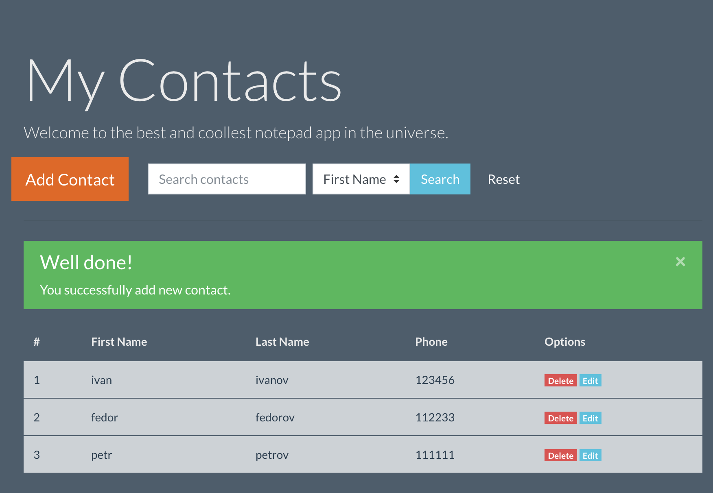
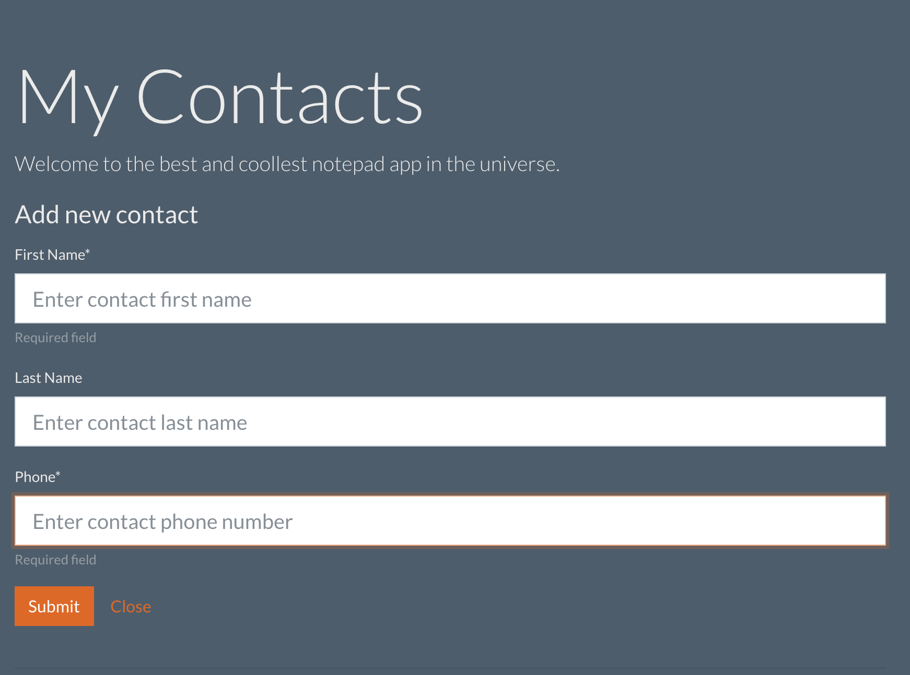

# Notepad Web App
---
Home work for the Netology.ru lesson "MongDB queries".

Using:
+ Add new MongoDB database `notepad` with `contacts` collection.
+ Run `mongod`
+ Run webserver `node app/index.js`

Used tools:
+ NodeJS
+ Express
+ MongoDB
+ JQuery
+ Bootstrap
+ body-parser

__Features__:
1. One page app without reloading.
2. List all contacts on main page.
3. Add a new contact with a first name, last name and phone fields.
4. Remove contacts.
5. Edit contacts in modal window.
6. Search in contacts list.

__To Do__
1. Pagination
2. Additional info
3. Contact info modal window
4. Forms validation

***

